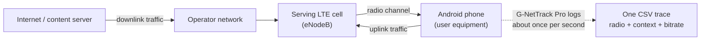
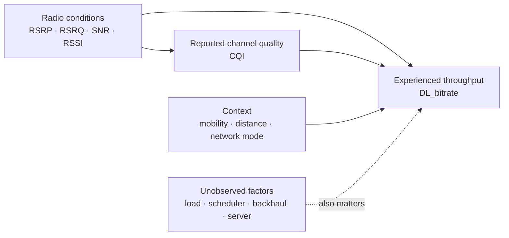
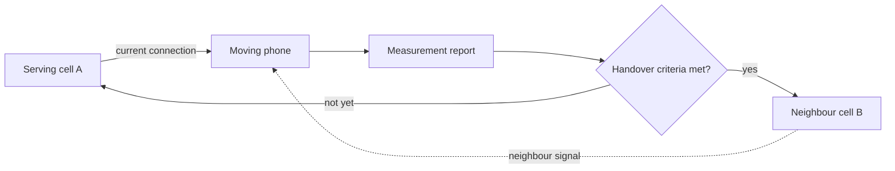

# Understanding the LTE Dataset

> My notes for understanding what this dataset actually represents.

This document is a companion to
[`01_lte_throughput_analysis.ipynb`](./01_lte_throughput_analysis.ipynb).
It is where I slow down and make sure I understand what the data is actually
describing: what one row means, why there are `car`, `bus`, `static`, and other
mobility folders, what the radio metrics represent, and what I can or cannot
conclude from them.

I am not trying to memorize every LTE term at once. I only want a clear mental
model of the data and the telecommunication concepts behind it.

## The Story Behind the Data

The simplest way I can picture the data collection is this:

1. A researcher carried an Android phone connected to a mobile network.
2. G-NetTrack Pro recorded client-side radio and context measurements.
3. A large file or video was downloaded to generate traffic.
4. Measurements were logged at roughly one sample per second.
5. Each CSV file stored one measurement trace or session.

At every observation, the phone recorded questions such as:

- How strong is the received signal?
- How clean is the radio channel?
- How fast is data arriving at the phone?
- Is the user stationary or moving?
- How fast is the user moving?
- Which cell is currently serving the phone?
- Are nearby cells becoming better candidates?

The main research story is therefore:

> When the radio conditions and the user's context change, how does the
> experienced mobile throughput change?



I may casually say **BTS** while learning, because it is familiar language.
For LTE, **eNodeB** is the more precise term for the base station. The dataset
also refers to a **serving cell**, which is the cell currently providing
service to the phone. A physical site and a cell are related, but they are not
always the same thing.

## Dataset at a Glance

The local dataset currently contains:

| Item | What I found |
| --- | --- |
| CSV traces | 135 |
| Total observations | 174,523 |
| Columns per trace | 20 |
| Nominal sampling interval | About one second |
| Operators | Two anonymized operators, mainly `A` and `B` |
| Mobility folders | `static`, `pedestrian`, `bus`, `car`, and `train` |
| Download state | `D` for downloading and `I` for idle |
| Main candidate target | `DL_bitrate`, measured in kbit/s |

## TL;DR — All 23 Columns

The original CSV files contain 20 columns. After adding three trace-level
identifiers—`Trace ID`, `Source Category`, and `Source File`—the working table
contains these 23 columns:

<!-- markdownlint-disable MD013 -->

| No. | Column | Data Type | Short Meaning |
| ---: | --- | --- | --- |
| 1 | `Trace ID` | `str` | Identifier for one measurement trace or session. |
| 2 | `Source Category` | `str` | Mobility folder: static, pedestrian, bus, car, or train. |
| 3 | `Source File` | `str` | Name of the original CSV trace file. |
| 4 | `Timestamp` | `str` | Date and time when the observation was recorded. |
| 5 | `Longitude` | `float64` | Longitude of the phone or user equipment. |
| 6 | `Latitude` | `float64` | Latitude of the phone or user equipment. |
| 7 | `Speed` | `int64` | Recorded movement speed in km/h. |
| 8 | `Operatorname` | `str` | Mobile operator recorded for the connection. |
| 9 | `CellID` | `int64` | Identifier of the serving cell. |
| 10 | `NetworkMode` | `str` | Active radio technology, such as LTE or HSPA+. |
| 11 | `RSRP` | `int64` | LTE reference-signal strength in dBm. |
| 12 | `RSRQ` | `object` | LTE reference-signal quality in dB. |
| 13 | `SNR` | `object` | Wanted signal compared with noise, in dB. |
| 14 | `CQI` | `object` | Channel Quality Indicator reported by the phone. |
| 15 | `RSSI` | `object` | Total received radio power in dBm. |
| 16 | `DL_bitrate` | `int64` | Application-layer download rate in kbit/s. |
| 17 | `UL_bitrate` | `int64` | Application-layer upload rate in kbit/s. |
| 18 | `State` | `str` | Download state: `D` for downloading or `I` for idle. |
| 19 | `NRxRSRP` | `object` | Reference-signal strength of a neighbouring cell. |
| 20 | `NRxRSRQ` | `object` | Reference-signal quality of a neighbouring cell. |
| 21 | `ServingCell_Lon` | `object` | Estimated longitude of the serving cell. |
| 22 | `ServingCell_Lat` | `object` | Estimated latitude of the serving cell. |
| 23 | `ServingCell_Distance` | `object` | Estimated phone-to-cell distance in metres. |

<!-- markdownlint-enable MD013 -->

`object` means the raw column currently contains mixed values rather than only
numbers. For example, several radio and serving-cell columns use `-` when a
measurement is unavailable.

The 135 traces are distributed as follows:

| Mobility context | Traces | What it represents |
| --- | ---: | --- |
| `static` | 15 | Indoor measurements while the device was stationary |
| `pedestrian` | 31 | Outdoor walking routes |
| `bus` | 16 | Urban and suburban public-transport routes |
| `car` | 53 | Urban and suburban driving routes |
| `train` | 20 | Longer rail journeys with mixed network availability |

An important detail is already visible: this is a 4G-focused dataset, but not
every recorded row uses LTE. My local copy contains several `NetworkMode`
values:

| Network mode | General generation |
| --- | --- |
| `GPRS`, `EDGE` | 2G |
| `UMTS`, `HSDPA`, `HSUPA`, `HSPA+` | 3G family |
| `LTE` | 4G |

The paper notes that many train measurements contain a mixture of 3G and 4G.
Therefore, `NetworkMode` identifies the technology used by each individual
observation instead of assuming that every row is LTE.

## What One Row Means

One row is one timestamped observation from one trace.

For example, the first local bus trace starts with a row similar to this:

| Field | Value |
| --- | ---: |
| Mobility folder | `bus` |
| `NetworkMode` | `LTE` |
| `Speed` | `0` |
| `RSRP` | `-102 dBm` |
| `RSRQ` | `-12 dB` |
| `SNR` | `10 dB` |
| `CQI` | `7` |
| `DL_bitrate` | `3 kbit/s` |
| `State` | `D` |

My reading of it is:

> At that instant, the phone was in a bus measurement session but its recorded
> speed was zero. It was connected through LTE and marked as downloading. The
> serving signal was fairly weak, while the measured downlink bitrate was only
> 3 kbit/s at that timestamp.

The folder describes the **measurement scenario**, not the speed of every
individual row. A bus can stop. A car can wait at a traffic light. GPS speed
can also be noisy. This is exactly why I should inspect the data instead of
guessing from a folder name.

The static traces make this limitation especially visible. Although 5,218
static observations record a non-zero speed, speed changes only 20 times across
15,234 consecutive-row comparisons, and every change appears together with a
coordinate change. The latest coordinate and speed readings are then repeated
across many rows. This step-like pattern is more consistent with periodic GPS
reporting than continuous physical movement, so the original speed values are
kept but interpreted cautiously.

## Bandwidth Is Not Throughput

These two words are easy to mix up:

- **Bandwidth or capacity** describes how much the channel or network could
  carry under particular conditions.
- **Throughput** describes how much data the user actually receives over time.

My simple analogy is a water pipe:

> The pipe size is the available capacity. The water that actually comes out
> is the experienced throughput.

A large pipe does not guarantee that a lot of water is flowing at every
moment. In the same way, strong coverage does not guarantee high throughput.

Throughput can be affected by:

- radio-signal strength and quality;
- interference and noise;
- scheduling and the number of competing users;
- allocated radio resources and channel bandwidth;
- backhaul or core-network congestion;
- transport-protocol behaviour;
- the content server;
- the device;
- mobility and handovers.

This dataset gives me several useful client-side signals, but it does not expose
every cause. That limitation matters when I interpret a prediction.

## Downlink and Uplink Bitrate

`DL_bitrate` is the application-layer download rate measured at the device:

```text
server → operator network → serving cell → phone
```

`UL_bitrate` is the application-layer upload rate:

```text
phone → serving cell → operator network → server
```

Both are recorded in **kbit/s**.

Downlink is often higher because mobile networks commonly allocate more
resources to the traffic direction that carries most user consumption.
However, that is a network-design tendency, not a rule that every row must
follow.

For this project, `DL_bitrate` is the candidate prediction target.

## A Mental Model for the Radio Metrics

Imagine trying to hear one person in a crowded room:

| Metric | Simple question | Crowded-room analogy |
| --- | --- | --- |
| `RSRP` | How strong is the reference signal? | Wanted voice volume |
| `RSRQ` | How good is its received quality? | Wanted voice clarity |
| `SNR` | Does the wanted signal dominate? | Voice versus room noise |
| `RSSI` | How much total power is received? | All sound reaching my ears |
| `CQI` | What channel quality is reported? | Delivery confidence |

These metrics overlap, but they do not answer the same question.

### RSRP — Reference Signal Received Power

`RSRP` represents the received power of the LTE reference signal from the
serving cell. It is mainly a **coverage-strength** measure.

A rough learning guide is:

| RSRP | Informal interpretation |
| ---: | --- |
| `≥ -80 dBm` | Very strong |
| `-90 to -80 dBm` | Good |
| `-100 to -90 dBm` | Fair |
| `-110 to -100 dBm` | Weak |
| `< -110 dBm` | Very weak |

Because the values are negative, `-85 dBm` is stronger than `-105 dBm`.

### RSRQ — Reference Signal Received Quality

`RSRQ` describes LTE reference-signal quality and is affected by the wider
received-power environment. It helps add **quality and interference context**
to RSRP.

A rough learning guide is:

| RSRQ | Informal interpretation |
| ---: | --- |
| `-9 to -3 dB` | Good |
| `-14 to -10 dB` | Fair |
| `-19 to -15 dB` | Poor |
| `≤ -20 dB` | Very poor |

The important idea is:

> Good RSRP does not guarantee good RSRQ.

The phone can be close to a cell and receive a strong wanted signal while the
radio environment is still busy or affected by interference.

### SNR — Signal-to-Noise Ratio

`SNR` compares the wanted signal with the background noise and interference.
Higher values generally describe a cleaner radio condition.

| SNR | Rough learning interpretation |
| ---: | --- |
| `> 20 dB` | Very good |
| `13 to 20 dB` | Good |
| `0 to 13 dB` | Fair to limited |
| `< 0 dB` | Poor |

If the wanted voice is loud and the room is quiet, SNR is high. If the room is
almost as loud as the speaker, SNR is low.

### RSSI — Received Signal Strength Indicator

`RSSI` represents total received wideband power. It includes more than the
wanted LTE reference signal:

- wanted signal energy;
- interference;
- noise;
- other received radio energy.

That is why a strong-looking RSSI value does not automatically describe a clean
LTE connection. For this project, I should not treat RSSI as a direct synonym
for LTE signal quality.

### CQI — Channel Quality Indicator

`CQI` is reported by the phone to help the network choose a suitable modulation
and coding configuration. It commonly ranges from `0` to `15`.

The high-level relationship is:

```text
higher CQI
→ the phone reports a better channel
→ the network may use a more efficient transmission configuration
→ higher throughput becomes possible
```

The word **possible** is important. CQI does not decide how many resource blocks
the scheduler will assign to this user. Two observations with the same CQI can
still have different throughput because load, scheduling, transport behaviour,
and other conditions differ.

All threshold tables above are learning aids, not universal pass/fail rules.
Operator configuration, frequency, bandwidth, device behaviour, and the exact
measurement implementation can change how values should be interpreted.

## Why RSRP Alone Is Not Enough

Consider this illustrative condition:

```text
RSRP = -80 dBm
RSRQ = -17 dB
SNR  = 1 dB
```

The wanted reference signal is strong, but the overall quality is poor and the
signal barely dominates the noise.

It is like someone speaking loudly in a room where everybody else is also
speaking loudly. I can hear plenty of sound, but understanding the intended
speaker is still difficult.

So the relationship I want to investigate is not:

```text
strong RSRP = guaranteed high throughput
```

It is closer to:



The model can learn associations from the observed inputs. It cannot prove that
one feature caused the throughput value.

## Serving Cells, Neighbour Cells, and Handover

The **serving cell** is the cell currently carrying the phone's connection.
The dataset also includes measurements related to a neighbouring cell:

- `NRxRSRP`: neighbouring-cell reference-signal strength;
- `NRxRSRQ`: neighbouring-cell reference-signal quality.

When a user moves away from the serving cell, a neighbour may become a better
candidate. The phone measures radio conditions and reports them to the network.
The network can then evaluate handover criteria.



A neighbour being slightly stronger does **not** mean an immediate handover.
The decision can involve hysteresis, time-to-trigger, priorities, and other
network policies. These safeguards help prevent rapid back-and-forth
**ping-pong handovers**.

The local CSV files use `-` in some neighbour fields. Those are not ordinary
numeric measurements and must be handled explicitly during cleaning.

## Download State

The paper and local data define two values:

| `State` | Meaning |
| --- | --- |
| `D` | The trace is in a downloading period |
| `I` | The trace is idle or not downloading |

`State` simply separates observations collected during an active download from
observations collected while the trace was idle.

## The Main Idea I Want to Remember

> `RSRP`, `RSRQ`, `SNR`, and `RSSI` describe different parts of the received
> radio condition. `CQI` summarizes reported channel quality for link
> adaptation. Context such as mobility, distance, and network mode helps explain
> the situation. `DL_bitrate` is the observed user result—not a direct measure
> of only one radio metric.

## Sources

- D. Raca, J. J. Quinlan, A. H. Zahran, and C. J. Sreenan,
  [“Beyond Throughput: a 4G LTE Dataset with Channel and Context Metrics”](https://doi.org/10.1145/3204949.3208123),
  ACM MMSys 2018.
- [Open-access accepted manuscript](https://cora.ucc.ie/handle/10468/6400),
  Cork Open Research Archive.
- [4G LTE Speed Dataset and Bandwidth](https://www.kaggle.com/datasets/aeryss/lte-dataset),
  Kaggle mirror used by this project.
